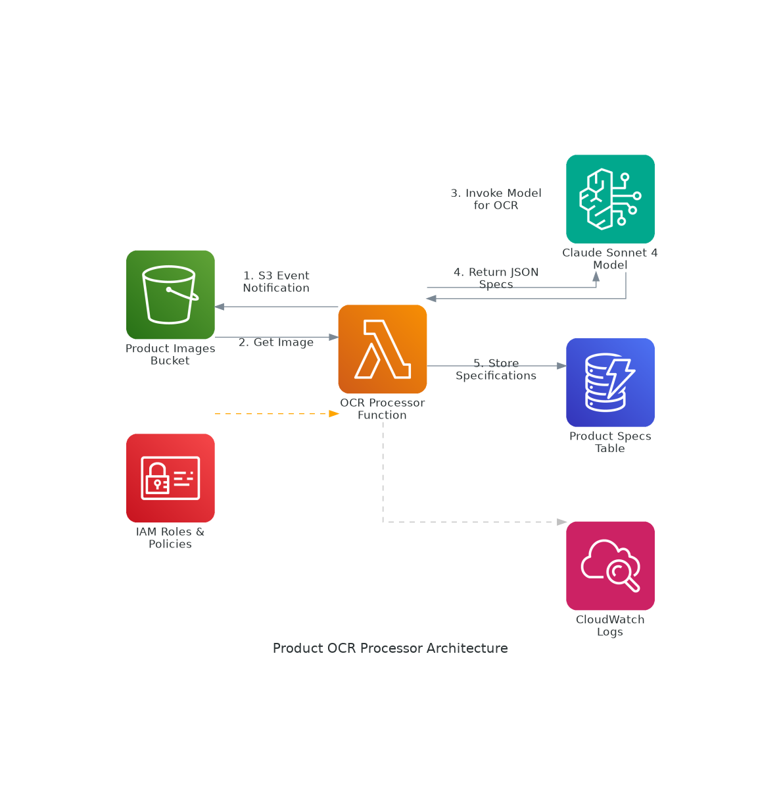

# Product OCR Processor

An AWS serverless solution for automated product specification extraction from images using OCR and AI-powered analysis.

## Overview

This system automatically processes product images uploaded to S3, extracts product specifications using AWS Bedrock's Claude model, and stores the structured data in DynamoDB. The solution follows specification-driven development principles and implements a complete serverless architecture.

## Architecture



### Components

- **S3 Bucket**: Stores uploaded product images and triggers processing
- **Lambda Function**: Processes images and orchestrates OCR workflow
- **AWS Bedrock**: Claude Sonnet 4 model for AI-powered image analysis
- **DynamoDB**: Flexible NoSQL storage for extracted product specifications
- **IAM**: Security roles and policies with least-privilege access
- **CloudWatch**: Monitoring and logging

## Features

- **Automated Processing**: Images uploaded to S3 automatically trigger OCR processing
- **AI-Powered OCR**: Uses Claude Sonnet 4 for accurate product specification extraction
- **Flexible Schema**: DynamoDB stores varying product information structures
- **Secure**: IAM roles with minimal required permissions
- **Scalable**: Serverless architecture scales automatically with demand
- **Monitored**: CloudWatch logging for debugging and monitoring

## Extracted Information

The system extracts:
- Product name
- Brand/manufacturer
- Specifications (ingredients, nutritional info, dosage, etc.)
- Any other visible product details

## Project Structure

```
├── specs/                          # Specification documents
│   ├── requirements.md             # User stories and acceptance criteria
│   ├── design.md                   # Technical architecture and design
│   └── tasks.md                    # Implementation plan and tasks
├── cdk-app/                        # AWS CDK infrastructure code
│   ├── lib/cdk-app-stack.ts       # Main CDK stack definition
│   ├── lambda/index.py             # Lambda function code
│   └── ...                         # CDK project files
└── generated-diagrams/             # Architecture diagrams
    └── product-ocr-architecture.png
```

## Deployment

### Prerequisites

- AWS CLI configured with appropriate permissions
- Node.js and npm installed
- AWS CDK CLI installed (`npm install -g aws-cdk`)

### Deploy Infrastructure

```bash
cd cdk-app
npm install
npm run build
npx cdk deploy
```

### Test the System

1. Upload a product image to the S3 bucket:
```bash
aws s3 cp your-product-image.jpg s3://product-images-1759435915570/
```

2. Check DynamoDB for extracted specifications:
```bash
aws dynamodb scan --table-name product-specifications-1759435915570
```

## Sample Output

```json
{
  "id": "a1a77f8d-7bbd-47fa-98e3-c766d8d00dab",
  "imageKey": "VitaminTabs.jpeg",
  "processedAt": "2025-10-02T20:19:47.262434",
  "processingStatus": "SUCCESS",
  "productSpecs": {
    "productName": "Vitamin C 250 mg",
    "brand": "Amazon Basics",
    "specifications": {
      "flavor": "Orange Flavor with Other Natural Flavors",
      "dosage": "250 mg per serving",
      "dietaryAttributes": ["Vegetarian", "Gluten-Free"],
      "quantity": "300 Gummies",
      "productType": "Dietary Supplement",
      "packagingType": "Value Pack"
    }
  }
}
```

## Specification-Driven Development

This project follows specification-driven development principles:

1. **Requirements Phase**: User stories with EARS notation acceptance criteria
2. **Design Phase**: Technical architecture and implementation considerations  
3. **Implementation Planning**: Discrete, trackable tasks with clear outcomes
4. **Execution Phase**: Progressive implementation with validation at each step

## Security

- IAM roles with least-privilege access
- S3 bucket with private access and encryption
- DynamoDB with encryption at rest
- No hardcoded credentials
- Secure data handling throughout the pipeline

## Monitoring

- CloudWatch Logs for Lambda function execution
- Error handling with DynamoDB error logging
- Processing status tracking for each image

## Cost Optimization

- On-demand DynamoDB billing
- Serverless Lambda execution (pay per request)
- S3 lifecycle policies can be added for cost optimization
- Bedrock pay-per-use pricing model

## Cleanup

To remove all resources:

```bash
cd cdk-app
npx cdk destroy
```

## License

This project is provided as-is for demonstration purposes.
